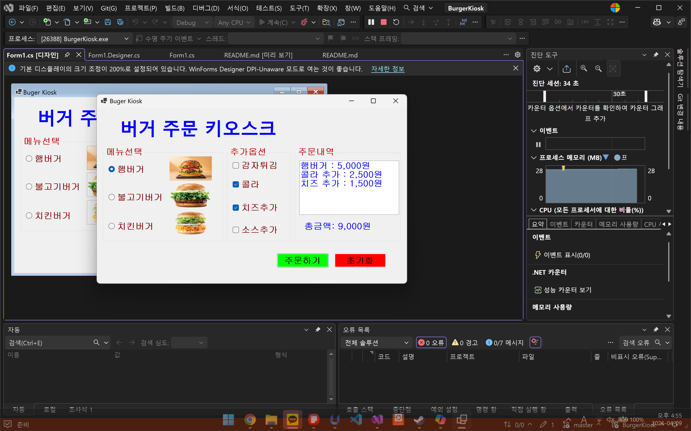
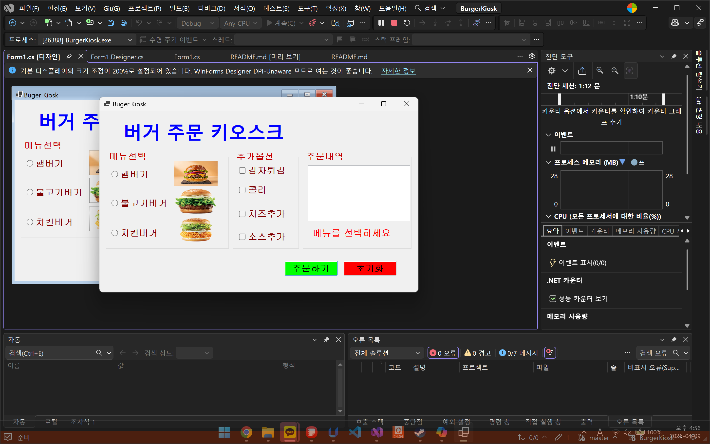
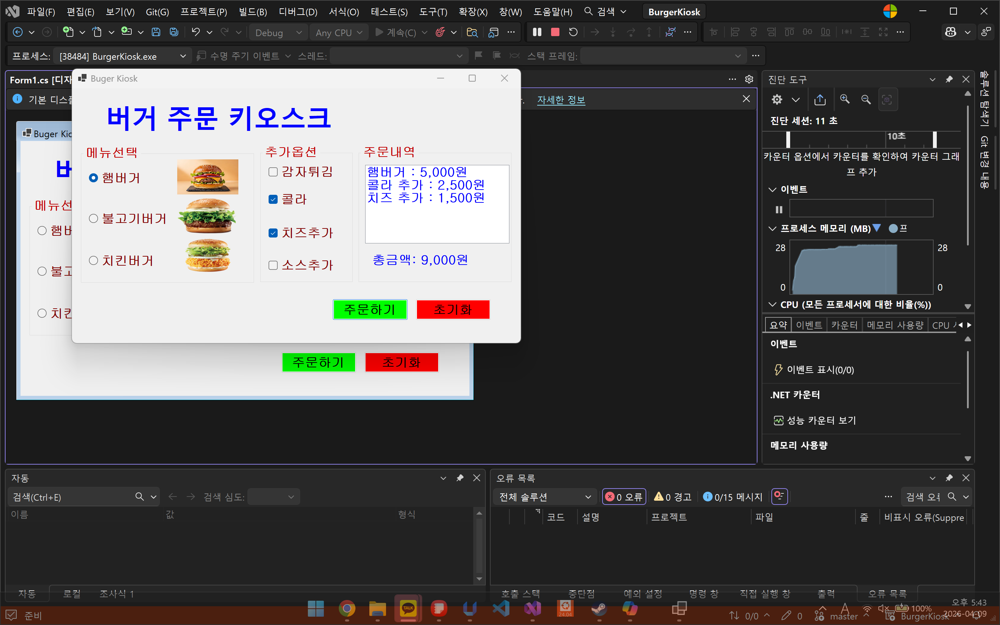
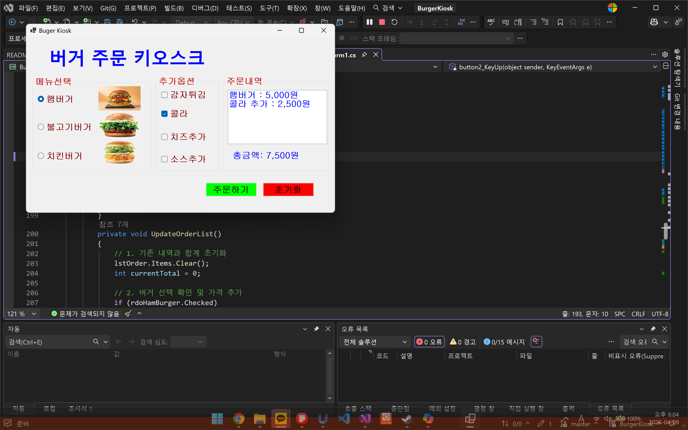

# (C# 코딩) 버거 키오스크
## 개요
- C# 프로그래밍 학습
- 1줄 소개: 햄버거와 사이드 메뉴를 선택하여 주문하는 키오스크 프로그램 
- 사용한플랫폼: 
  - C#, .NET Windows Forms, Visual Studio, GitHub
-사용한컨트롤:
  - Label, TextBox, ListBox, Button, pictureBox, CheckBox, listBox, GroupBox 등등
- 사용한 기술과 구현한 기능 : 
  - 체크박스와 라디오버튼을 활용한 메뉴 선택 기능
  - 리스트박스를 이용한 선택 항목 표시
  - 주문하기 버튼을 통한 총 합계 계산
  - 초기화 버튼을 통한 선택 항목 및 총 합계 초기화
  - 탭 순서 설정을 통한 키보드 조작 지원
  - 폰트 색상 변경을 통한 시각적 피드백 제공

## 실행화면
-코드의 실행 스크린샷과 구현내용 설명

- 구현한내용(위그림참조)
	- 체크박스를 활용하여 항목을 복수로 선택할 수 있도록 함.
	- 라디오버튼를 이용하여 항목을 단일로 선택할 수 있도록 함.
	- 체크박스와 라디오버튼의 선택된 항목을 리스트박스에 추가하여 보여줌.
	- 체크박스와 라디오버튼을 선택할 후 주문하기 버튼을 누르면 선택된 항목이 리스트 박스에 추가되고, 총 합계에 선택된 항목의 총 금액이 표시됨.
	- 초기화 버튼을 누르면 체크박스와 라디오버튼의 선택이 초기화되고, 리스트박스에 추가된 항목과 총 합계가 초기화됨.
  
## 실행화면
-코드의 실행 스크린샷과 구현내용 설명

 
- 구현한내용(위그림참조)
	- 체크박스와 라디오버튼을 선택하지 않고 주문하기 버튼을 누르면 메뉴를 선택하세요라는 빨간 글씨가 나타나도록 함. 
	- 폰트 색깔을 조정하여 총 합계를 보여줄 때는 파란색으로, 메뉴를 선택하세요라는 글씨는 빨간색으로 나타나도록 함.
  

## 실행화면
-코드의 실행 스크린샷과 구현내용 설명

- 구현한내용(위그림참조)
	- 탭 순서를 설정하여 키보드만으로 주문을 할 수 있도록 함. 
	- 탭을 누르면 그룹박스의 체크박스, 라디오버튼, 주문하기 버튼, 초기화 버튼 순으로 이동하도록 설정함.
	- 엔터와 스페이스바를 이용하여 항목을 선택하고 주문하기 버튼과 초기화 버튼을 누를 수 있도록 설정함. 
  

## 실행화면
-코드의 실행 스크린샷과 구현내용 설명

- 구현한내용(위그림참조)
	- 체크박스와 리스트박스에 선택된 항목을 바로바로 리스트 박스에 보이도록 함. 
	- 체크박스와 리스트 박스에서 선택된 항목의 총 합계를 실시간으로 보여주도록 함. 
	- 체크박스와 리스트 박스에서 다른 항목을 선택하면 리스트 박스에 보이는 항목과 총 합계가 변경되도록 함.
  